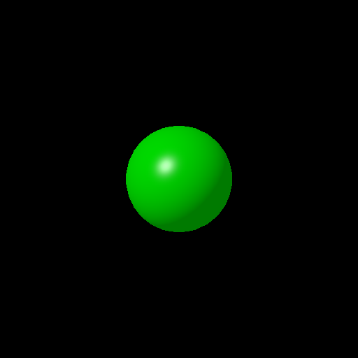

# computer-graphics-hw6
## 컴파일 & 실행 방법
computer-graphics-hw6.sln을 실행시키면 소스파일에 flat_sphere_scene.cpp, gouraud_sphere_scene.cpp, phong_sphere_scene.cpp가 있습니다.

처음에는 phong_sphere_scene.cpp 파일만 가장 하단에 main이고 나머지는 main1,2로 되어 있습니다. 원하는 기능의 파일을 가장 하단의 함수를 main으로 하고 나머지는 main외 다른 이름으로 변경한 뒤 실행하면 됩니다.
## 실행 결과
### flat

### gouraud

## phong

